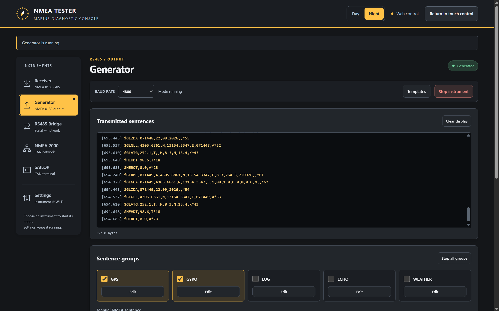
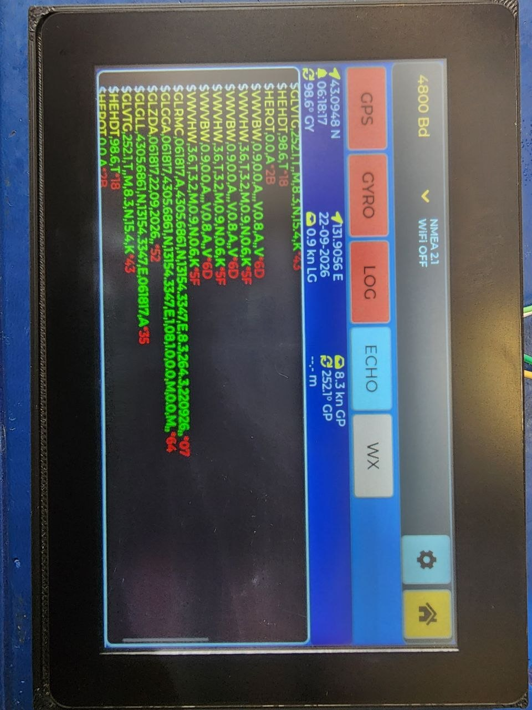

# NMEA Tester for Waveshare ESP32-S3 Touch LCD 5

NMEA Tester is touchscreen firmware for inspecting, generating, and bridging marine instrument data. It targets the **Waveshare ESP32-S3-Touch-LCD-5 (800×480)** and combines NMEA 0183 over RS-485, AIS decoding, a browser console, Wi-Fi terminal access, a raw serial bridge, and a partial NMEA 2000 monitor on one device.

The project is a practical development and service tool. It is not NMEA-certified and is not intended to replace certified navigation equipment.

## Features

| Mode | Capabilities |
|---|---|
| RX485 | Live NMEA 0183 log, instrument panel, pause/resume, byte activity indicator, selectable baud rate, and raw 16-byte HEX/ASCII dump |
| TX485 | Editable GPS, gyro, log, echo sounder, and weather templates; independent group rates; optional checksums; live output log |
| AIS | Automatic AIVDM/AIVDO detection, multipart assembly, and decoded target list |
| RS485-PC | Raw bidirectional RS-485 ↔ Telnet/UDP bridge with traffic counters |
| NMEA 2000 | Device and traffic monitor, transport reassembly, and selected human-readable PGN decoders |
| SAILOR bridge | TT6006-style CAN service client for TT3027 antenna telemetry and terminal access; signal, serial, position, ocean, registration, protocol, and channel |
| Wi-Fi | AP and STA modes, network scan, saved credentials, embedded HTTP/WebSocket console, Telnet, and UDP NMEA endpoints |
| UI | 800×480 touch interface with Color, Metal, and B/W themes and 180° rotation; responsive browser interface with independent Day/Night themes |

Wi-Fi is intentionally **off after every power-on**. Its AP/STA configuration is retained in NVS, but the radio must be enabled from the main screen for each session.

## Browser quick start

1. Enable Wi-Fi on the tester and connect to its access point, or place the tester and browser on the same network using STA mode.
2. Open the address shown on the tester's **WI-FI ON** button. The default AP address is `http://192.168.4.1/`.
3. Select **Connect to instrument** to take control. Opening the page alone does not take control.
4. Select a mode tab to use the receiver, generator, RS-485 bridge, NMEA 2000 monitor, or SAILOR bridge.

One browser session controls the instrument at a time. During web control the LCD shows a globe, separate RS-485/CAN RX and TX indicators, and a **Return control** button. The running mode continues if the browser disconnects; touch control returns 60 seconds after the last successful connection or heartbeat unless that session reconnects first. Either return-control button releases it immediately.

The page is included in the firmware and works without internet access or external assets. See the [web interface guide](WEB_INTERFACE.md) for mode behavior, terminal scrollback, and reconnect details.



*Browser console: live NMEA output above the generator group controls, shown in the Night theme.*

## Hardware

Active target:

- [Waveshare ESP32-S3-Touch-LCD-5](https://www.waveshare.com/wiki/ESP32-S3-Touch-LCD-5), 800×480
- ESP32-S3 at 240 MHz
- 16 MB flash
- 8 MB Octal PSRAM at 80 MHz
- 16-bit RGB565 LCD at a 16 MHz pixel clock
- GT911 capacitive touch controller
- PCF85063 battery-backed RTC
- CH422G I/O expander
- onboard automatic-direction RS-485 transceiver
- classic CAN through the ESP32-S3 TWAI controller

The configuration also retains inactive profiles for earlier 480×320 prototypes and the
1024×600 Waveshare 5B. They are development profiles and are not currently supported
or validated by this public release.

<p align="center">
  
</p>

*The instrument in its enclosure, displaying generated NMEA sentences on the touchscreen.*

### Pin assignment

| Interface | Signal | Pin |
|---|---|---:|
| RS-485 / UART2 | RX | GPIO43 |
| RS-485 / UART2 | TX | GPIO44 |
| CAN / TWAI | RX | GPIO16 |
| CAN / TWAI | TX | GPIO15 |
| Shared I²C0, 400 kHz | SDA | GPIO8 |
| Shared I²C0, 400 kHz | SCL | GPIO9 |
| GT911 | IRQ | GPIO4 |
| RGB LCD | HSYNC | GPIO46 |
| RGB LCD | VSYNC | GPIO3 |
| RGB LCD | DE | GPIO5 |
| RGB LCD | PCLK | GPIO7 |
| RGB LCD | B3, B4, B5, B6, B7 | GPIO14, 38, 18, 17, 10 |
| RGB LCD | G2, G3, G4, G5, G6, G7 | GPIO39, 0, 45, 48, 47, 21 |
| RGB LCD | R3, R4, R5, R6, R7 | GPIO1, 2, 42, 41, 40 |
| CH422G | Touch reset | EXIO1 |
| CH422G | LCD enable | EXIO2 |
| CH422G | LCD reset | EXIO3 |
| CH422G | SD chip select | EXIO4 |

The PCF85063 uses I²C address `0x51`. RS-485 defaults to 4800 baud and can be switched between 2400, 4800, 9600, 19200, 38400, and 115200 baud. The NMEA 2000 monitor defaults to 250 kbit/s and also offers 125 and 500 kbit/s.

## NMEA 0183 transmitter

The transmitter exposes 21 selectable outputs in five groups. HDT is replaced by THS when the NMEA 4.11 profile is selected.

| Group | Generated sentences |
|---|---|
| GPS | RMC, GGA, ZDA, GLL, VTG |
| GYRO | HDG, HDM, HDT or THS, ROT |
| LOG | VHW, VLW, VBW |
| ECHO | DBT, DPT, DBK, DBS |
| WX | MWD, MWV, VWR, VWT, MTW |

Each group has an independent rate from 0.5 to 10 Hz. Templates include editable values, talker IDs, `$` or `!` prefix selection, individual sentence switches, and optional XOR checksums. Frames are terminated with canonical CR/LF and constrained to the NMEA 0183 82-byte wire length.

The gyro group can emit signed ROT in degrees per minute with `A` or `V` status. Optional **FOLLOW ROT** motion advances true and magnetic headings using real elapsed time, wraps them through 0/360 degrees, and freezes motion while the group is disabled.

### Version profiles

| Profile | Implemented formatting behavior |
|---|---|
| 2.1 | Legacy RMC/GLL/VTG fields without a position-mode indicator; HDT |
| 2.3 | Position-mode indicator in RMC/GLL/VTG; HDT; default profile |
| 4.0 | Same implemented formatter behavior as the 2.3 profile |
| 4.10 | Adds RMC navigational status; HDT |
| 4.11 | Adds RMC navigational status and emits THS with simulator mode instead of HDT |

The selected profile and all transmitter templates are stored in NVS.

Generated traffic is sent on RS-485 and mirrored in the local TX display. It is **not broadcast automatically over Telnet or UDP**. Network input can be injected into TX485, while transparent network forwarding is provided separately by the RS485-PC bridge.

## NMEA 0183 receiver and AIS

RX485 displays received NMEA-style lines and can switch to a raw dump formatted as:

```text
0000: 24 47 50 52 4D 43 2C 31 32 33 35 31 39 2C 41  |$GPRMC,123519,A|
```

The raw view uses 16 bytes per row, a hexadecimal stream offset, and printable ASCII for bytes from `0x20` through `0x7E`.

The instrument panel decodes these sentences:

```text
ZDA RMC GGA GLL VTG
VBW VHW
THS HDT HDG HDM
DPT DBT DBS DBK
MWD MWV VWR VWT MTW
```

Other NMEA-style sentences can still appear in the log but are not converted into instrument-panel values. A checksum is optional for panel input; when present, it must be valid.

AIS accepts `!AIVDM` and `!AIVDO`, including multipart payloads. The target view decodes AIS message types 1, 2, 3, 5, 18, 19, and 24.

## CAN and NMEA 2000 scope

The CAN path uses classic 29-bit extended CAN frames through ESP32-S3 TWAI. CAN FD is not supported.

The internal NMEA 2000 stack supports single-frame messages, Fast Packet, BAM,
RTS/CTS, address claiming, and ISO requests/acknowledgements. The monitor builds
a passive device list from observed traffic and displays raw or decoded messages.

Built-in human-readable decoders cover:

| Category | PGNs |
|---|---|
| Rudder and fluid levels | 127245, 127505 |
| Engine, gear, and DC status | 127488, 127489, 127493, 127508 |
| GNSS and time | 129025, 129026, 129029, 129033, 129539 |
| AIS | 129038, 129039, 129793, 129794, 129809 |
| Navigation and environment | 126992, 127250, 127257, 130306, 130310, 130311 |

Device services additionally handle PGNs 59904 and 60928. PGN 126208 handling is
limited to a minimal acknowledgement. Responses for PGNs 126996 and 126998 use
experimental project-specific compact payloads; they are not standards-conformant
Product or Configuration Information encoders. This is a focused monitor and test
implementation, not a complete or certified NMEA 2000 stack. The Sailor CAN bridge
is device-specific and should not be treated as a generic NMEA 2000 gateway.

The NMEA 2000 monitor derives a stable 21-bit identity number and a serial string
from the board's factory MAC address. This replaces a shared fixed identity; it
is not a random serial generator. A 21-bit hash does not guarantee collision-free
identities. Manufacturer code 2046 remains an experimental project placeholder,
not an assigned certification or approval.

### SAILOR antenna status and terminal

The bridge implements the TT6006 service profile over CAN, with separate NDP
connections for binary antenna status and the Mini-C terminal. Remote service
ports and antenna identity are discovered; the bridge does not require fixed
antenna source addresses or copied antenna serial numbers.

Both the local bridge screen and browser show C/N0 in dBHz, signal bars, antenna
serial, latitude/longitude, current ocean, registration, current protocol, and
TDM channel. Network status is requested approximately every five seconds;
expired values are marked stale. The ocean is the currently registered region,
not the preferred-ocean setting. The status poller only issues read requests.

The browser terminal supports basic 80×24 VT100 cursor/erase behavior and up to
2,000 lines of scrollback. The terminal also remains accessible through the
selected RS-485 or Telnet route when browser control is released.

The bridge's own CAN NAME uses the compatibility profile's manufacturer 351,
function 160, and class 80 fields, with a MAC-derived 21-bit identity. Its
advertised serial is also derived from the board MAC. These compatibility
fields do not identify the tester as genuine SAILOR hardware or imply vendor
approval. This implementation covers status and terminal access, not TT6006
messaging, GMDSS, distress operation, or PPP/IP services. See the
[TT6006 service profile](docs/tt6006-profile.txt) for protocol details and limits.

## Wi-Fi and network services

Default AP settings:

| Setting | Default |
|---|---|
| SSID | `nmeatester` |
| Password | `12345678` |
| Address | `192.168.4.1` |
| Channel | 6 |
| Maximum AP stations | 1 |
| Browser console | HTTP port 80; WebSocket `/ws`; one controlling session |
| Telnet | TCP port 23 |
| UDP NMEA | UDP port 10110 |

AP and STA settings can be changed under **SETUP → WiFi Settings** or the browser **Settings** tab. STA mode provides scanning and password entry. Each AP/STA configuration is saved as one NVS record; storage failures are reported without applying the failed save to the running radio.

> Security: the bundled AP password is only a demonstration default. Change it before using the tester outside a controlled bench network. HTTP, WebSocket, Telnet, and UDP are unencrypted, and there is no separate user login. The browser ownership token manages one controller; it is not a substitute for network access control.

## Prerequisites

- Git
- ESP-IDF 5.5; the lock file was generated with ESP-IDF 5.5.0
- an initial internet connection so the ESP-IDF component manager can download dependencies
- a data-capable USB cable
- optional: `make`, a C11 compiler with pthreads, and Python 3 for host tests
- optional: Node.js, Playwright, and Chromium for browser tests

Pinned managed components include:

| Component | Locked version |
|---|---:|
| LVGL | 8.4.0 |
| ESP LCD Touch | 1.2.1 |
| ESP LCD Touch GT911 | 1.1.3 |

Node.js and npm are not required to build or run the firmware. CMake compresses the embedded web page with the ESP-IDF Python interpreter.

## Get the source

Clone the repository and enter it:

```sh
git clone https://github.com/ksanf/nmea-tester-waveshare.git
cd nmea-tester-waveshare
```

## Build, flash, and monitor

Open a shell in the repository and activate ESP-IDF:

```sh
. /path/to/esp-idf-v5.5/export.sh
idf.py build
```

As a convenience, `source ./run-esp.sh` locates a configured ESP-IDF checkout,
selects `/dev/ttyACM0` unless `ESPPORT` is already set, and enters the project
directory.

Flash and open the USB Serial/JTAG console, replacing the port when necessary:

```sh
idf.py -p /dev/ttyACM0 flash
idf.py -p /dev/ttyACM0 monitor
```

You can combine both operations:

```sh
idf.py -p /dev/ttyACM0 flash monitor
```

After the ESP-IDF environment is active, the repository also provides convenience targets:

```sh
export ESPPORT=/dev/ttyACM0
make build
make flash
make monitor
```

`make flash` uses a 921600 baud upload rate. The serial monitor runs at 115200 baud.

### USB pass-through to WSL

When building inside WSL 2, attach the board with `usbipd-win`. In an elevated Windows PowerShell window:

```powershell
usbipd list
usbipd bind --busid <BUSID>
usbipd attach --wsl --busid <BUSID>
```

The `bind` operation is normally required only once. Inside WSL, confirm the device node:

```sh
ls -l /dev/ttyACM*
```

When finished, detach it from Windows:

```powershell
usbipd detach --busid <BUSID>
```

## Tests

Run the portable C suite on Linux or WSL with `make`, a C11 compiler, pthreads,
and the math library. On Debian or Ubuntu, `build-essential` supplies the build
tools. With the ESP-IDF environment active:

```sh
make -C tests/host test
```

For a fresh checkout without an active ESP-IDF environment, provide its path:

```sh
make -C tests/host test IDF_PATH=/path/to/esp-idf-v5.5
```

The suite uses the same cJSON source as the firmware and exercises NMEA/AIS,
web ownership and templates, CAN/NDP telemetry, Telnet fragmentation, Wi-Fi
storage failures, and clock fallback. See the [host test guide](tests/host/README.md)
for dependencies and coverage.

Optional browser checks use real Chromium with simulated device messages:

```sh
npm install --prefix .cache/browser-tests playwright
.cache/browser-tests/node_modules/.bin/playwright install chromium
NODE_PATH="$PWD/.cache/browser-tests/node_modules" node --test tests/web/test_client.cjs
```

The [HTTP dispatcher regression](tests/web/server_host/README.md) separately
checks the production server with AddressSanitizer and UndefinedBehaviorSanitizer:

```sh
sh tests/web/server_host/run.sh
```

Host and browser tests do not certify the device or replace CAN/Wi-Fi load,
power-loss, and long-duration hardware testing.

## Configuration

- `main/config/config_nmea_tester.h` — active display profile, RS-485 defaults, Wi-Fi defaults, network ports, and UI/runtime limits.
- `main/config/config_pins.h` — board pin assignment.
- `main/config/memory_config.h` — internal RAM versus PSRAM placement.
- `main/config/config_logs.h` — compile-time diagnostic logging switches.
- `sdkconfig.defaults` — ESP32-S3, flash, PSRAM, USB console, LVGL, and FreeRTOS defaults.
- `partitions.csv` — NVS, factory application, and SPIFFS partition layout.

Large UI and monitoring buffers are placed in PSRAM, while latency-sensitive transport state stays in internal memory. The PCF85063 RTC is the primary source for generated GPS date/time fields. Valid RTC readings and accepted time edits synchronize the CPU fallback, which continues while RTC reads fail. If no valid time source exists, the clock does not publish a fabricated date. The CPU fallback cannot recover time elapsed while the board had no power.

## Project structure

```text
main/
├── app_main.c                 Startup and service lifecycle
├── app/                       Mode lifecycle, control ownership, and navigation state
├── web/                       Embedded browser page, HTTP/WebSocket, and template API
├── config/                    Board, memory, UI, and logging configuration
├── system/                    Board I/O, RTC, clock, NVS, Telnet, and UDP
├── wifi/                      AP/STA manager and network scanning
├── lvgl_port/                 Local RGB LCD/LVGL port
├── touch/                     GT911 touch driver
├── ui/                        Themes, widgets, instrument panel, and screens
├── nmea_editor/               Templates, formatter, profiles, motion, and NVS
├── rs485/                     UART driver, RX parser, HEX view, and TX engine
├── rs485_bridge/              Raw Wi-Fi ↔ RS-485 bridge
├── AISdecoder/                AIS parser, decoder, target store, and UI
└── can_module/                TWAI, NMEA 2000 monitor, and Sailor CAN bridge

tests/host/                     Hardware-independent C tests
tests/web/                      Browser and HTTP dispatcher regressions
docs/                          Protocol implementation notes
```

## Known scope and limitations

- The active display target is the 800×480 Waveshare ESP32-S3-Touch-LCD-5. The legacy 480×320 and 1024×600 5B profiles are inactive and unvalidated.
- Only one feature owns the shared RS-485 UART at a time.
- CAN support is classic CAN only, not CAN FD.
- NMEA 2000 support is intentionally partial and is not certified.
- PGNs 126996/126998 use experimental compact payloads, and PGN 126208 support is acknowledgement-only.
- The instrument panel decodes only the listed NMEA 0183 sentence types.
- Wi-Fi AP channel selection is fixed to channel 6 in the current implementation.
- Generated TX traffic is not automatically broadcast to Telnet or UDP.
- Browser control is limited to one active session. Display histories and transport queues are bounded; an extended disconnect may lose old output.
- The SAILOR bridge implements status and terminal services, not messaging, GMDSS, distress operation, or PPP/IP.
- Network services provide no encryption or separate user authentication beyond the Wi-Fi network itself.

## License

The original project source is released under the [MIT License](LICENSE).
Vendored and generated portions retain their respective licenses; see
[Third-party notices](THIRD_PARTY_NOTICES.md) for details.

NMEA 0183 and NMEA 2000 are referenced descriptively. This project is not
affiliated with or certified by the National Marine Electronics Association.
